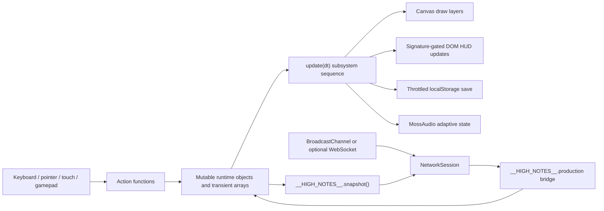

# HIGH NOTES V2 Architecture Baseline

This document records the architecture that exists before the V2 production expansion. It is an evidence-based map of the current repository, not a description of the desired end state.

Audit baseline: 1 August 2026, branch `main`, commit `057c1b0c05ffefa8fc531b1f08579438d93d29af`, remote `origin` at `https://github.com/EEMS0/high-notes-echoes-of-mossvale.git`. The worktree was clean when the V2 audit began.

## 1. Repository and delivery model

HIGH NOTES is a dependency-free browser game at runtime. It is served directly from repository files; there is no application bundle, module loader, transpilation step, or runtime package dependency.

| Concern | Current implementation | Evidence |
| --- | --- | --- |
| Main entry point | `index.html` creates the game shell, main canvas, HUD, touch controls, and DOM overlays. | `index.html:27-132`, `index.html:134-541` |
| Script order | Four deferred classic scripts execute in document order: audio, sprite runtime, game runtime, then Version 1 systems. | `index.html:18-22` |
| Styling | One global stylesheet owns the game shell, overlays, responsive layout, accessibility states, touch UI, production hub, and arena. | `styles.css:108-159`, `styles.css:442`, `styles.css:1790-1904`, `styles.css:2506-2615`, `styles.css:3433-3613` |
| Build/package manager | None. There is no `package.json`, lock file, application build script, lint script, or test script in the repository. | Repository audit; local play instructions use `python -m http.server` (`README.md:5-13`). |
| Sprite tooling | Two standalone CommonJS scripts build and validate production sprites and import `sharp`, but the dependency is not declared or locked in this repository. | `tools/build-production-sprites.cjs:16-23`, `tools/validate-production-sprites.cjs:7-10` |
| Deployment | A GitHub Actions workflow deploys the entire checked-out repository on every push to `main`; manual dispatch is also enabled. | `.github/workflows/static.yml:4-10`, `.github/workflows/static.yml:24-43` |
| Install metadata | A web-app manifest launches at the repository-relative root in standalone landscape mode. | `manifest.webmanifest:1-13` |
| Offline/cache worker | No service worker or cache manifest is present. JavaScript and CSS cache invalidation currently relies on query-string versions in `index.html`. | `index.html:18-22`; repository audit found no service-worker/cache source. |

The expected Pages origin is `https://eems0.github.io/high-notes-echoes-of-mossvale/`, inferred from the configured GitHub remote and the standard project Pages route. GitHub Pages hosts only static client files; it cannot provide a persistent WebSocket relay.

## 2. Runtime topology and entry points

All four JavaScript files are immediately invoked closures except `audio.js`, which is an IIFE containing a class and singleton. They communicate through a deliberately small set of `window` globals.

| File/global | Responsibility | Public boundary |
| --- | --- | --- |
| `audio.js` | Procedural Web Audio music, SFX, scheduler, volume control, adaptive layers, and page lifecycle recovery. | `window.MossAudioEngine` and singleton `window.MossAudio` (`audio.js:13-88`, `audio.js:1120-1125`). |
| `sprite-runtime.js` | Loads the central sprite catalog, lazy-loads per-character manifests and PNGs, chooses animation frames, and draws them into a supplied canvas context. | `window.MossSprites` (`sprite-runtime.js:29-105`, `sprite-runtime.js:119-187`). |
| `game.js` | The principal game engine: persistent state, world data, player/enemy/Odin/boss logic, combat, quests, shops, UI, collision, camera, main rendering loop, and save migration. | `window.__HIGH_NOTES__` snapshot/production/debug bridge (`game.js:8996-9233`). |
| `v1-expansion.js` | Production hub UI, contracts, professions/crafting views, social views, room client, remote-player presentation, and the separate Echo Arena simulation. | Consumes `window.__HIGH_NOTES__`; exposes `window.HighNotesV1` (`v1-expansion.js:31-49`, `v1-expansion.js:1317-1328`). |

The deferred ordering matters. `game.js` synchronously creates `window.__HIGH_NOTES__` and boots before `v1-expansion.js` checks for that API (`game.js:8996-9237`, `v1-expansion.js:31-39`). `sprite-runtime.js` begins an asynchronous manifest fetch immediately, so `game.js` is designed to render while sprite records are still loading (`sprite-runtime.js:125-129`, `sprite-runtime.js:189`).

### Boot and frame lifecycle

`boot()` synchronises the viewport, activates Stage 1, instantiates its enemies, binds controls, applies settings, initialises UI visibility, and starts the animation frame (`game.js:8882-8902`). Every browser frame:

1. `frame(time)` clamps delta time to at most 34 ms.
2. `update(dt)` always advances toast/buff/audio-facing state and polls the gamepad, then returns early when gameplay is blocked by pause, orientation, dialogue, or an overlay.
3. Active gameplay updates quests, rhythm, player, onboarding, Odin, attacks, pulses, enemies, projectiles, pickups, hazards, bosses, encounter director, Dream Encore, particles, camera, HUD, and throttled saving in that order.
4. `draw()` is called only when gameplay should animate or `canvasDirty` is set. The world map has its own capped redraw path.

Evidence: `game.js:6999-7023`, `game.js:8817-8879`.

## 3. Canvas and DOM responsibilities

### Canvas-owned presentation

The primary `gameCanvas` has a fixed 960×540 internal resolution and is scaled by CSS (`index.html:27-35`, `styles.css:108-141`). `game.js` owns all world-space drawing: terrain, water, decoration, wildlife, labels, interactables, NPCs, enemies, projectiles, bosses, Odin, remote players, player, combat effects, weather, vignette, prompts, objective arrow, and boss HUD. The authoritative render order is explicit in `draw()` (`game.js:8817-8860`).

Two additional canvases are used:

- `mapCanvas` is static HTML and receives the illustrated world atlas plus animated markers (`index.html:475-487`, `game.js:5093-5297`).
- `echoArenaCanvas` is generated into the production hub with `innerHTML` and runs a separate 900×500 renderer (`v1-expansion.js:1190-1215`).

### DOM-owned presentation

The HUD, toast, touch controls, title screen, pause/settings/how-to panels, dialogue, inventory, shop, skills, instruments, player home, statistics, composer, map/quest log, production hub, finale, and portrait-rotation notice are DOM elements in `index.html`. `game.js` toggles overlays and applies `inert`/`aria-hidden` isolation through `setOverlayIsolation()` (`game.js:305-335`).

The main HUD is mutation-gated by a string signature, avoiding repeated DOM work when visible values do not change (`game.js:2336-2359`). The same HUD update sends progress and adaptive scene state to `MossAudio` (`game.js:2423-2431`). The production hub is different: `v1-expansion.js` replaces `productionHubContent.innerHTML` per selected tab and binds listeners to the newly created nodes (`v1-expansion.js:1243-1250` and, for the arena, `v1-expansion.js:1190-1240`).

### Responsive/mobile boundary

Viewport measurements are converted into CSS variables, including shell-relative safe-area gutters (`game.js:223-302`; `styles.css:10-13`). Touch input uses a floating pointer joystick plus action buttons; fallback directional controls are present in the DOM (`index.html:87-132`, `game.js:5802-5858`). The canvas and arena disable native touch gestures (`styles.css:132-141`, `styles.css:3433-3438`). Portrait touch devices pause and isolate the game until rotated (`game.js:289-297`).

## 4. Functional subsystems in `game.js`

`game.js` is a single closure, not a set of formal manager classes. The names below describe cohesive function/data clusters and their real extension seams.

| Subsystem | Primary data/functions | Evidence |
| --- | --- | --- |
| World/levels | `LEVELS`, `activateLevel`, `generateDecorations`, `stagePortals`; four region records replace shared world references on activation. | `game.js:1124-1177`, `game.js:1248-1274` |
| Player controller | Mutable `player`; `updatePlayer`, `moveWithCollision`, `gateBossArena`, camera follow. | `game.js:542-570`, `game.js:2808-2813`, `game.js:6030-6126`, `game.js:6757-6763` |
| Input | `keys`, touch `controlContacts`/joystick, short action buffers, keyboard handlers, and per-frame standard-gamepad polling. | `game.js:572`, `game.js:628`, `game.js:5401-5602`, `game.js:5457-5523`, `game.js:5712-6023` |
| Player combat | `attacks`, `pulses`, instrument profiles, Rhythm Combo, attack/dash/pulse, block/perfect-block/counter, damage/death. | `game.js:573-574`, `game.js:2267-2334`, `game.js:3210-3402`, `game.js:3469-3647`, `game.js:6030-6243` |
| Instruments/Resonance | `RESONANCE_BUILDS`, `INSTRUMENTS`, mastery records/nodes, specials and ultimates. | `game.js:3977-4211`, `game.js:3281-3322` |
| Enemy catalog/factory | Forty species in stage-indexed data, eight elite definitions, eleven mini-boss definitions; `makeEnemy` converts compact blueprints to mutable records. | `game.js:934-1055` |
| Enemy AI/combat | One update loop dispatches on `type`, `ai`, and string `mode`; it manages spawn warmup, aggression, attacks, cooldowns, contact damage, return-home behavior, and animation state. | `game.js:6416-6695` |
| Spawn/onboarding | `FIRST_STAGE_BALANCE`, `canSpawnEnemy`, bounded `findValidEnemySpawn`, `prepareEnemyForSpawn`, tutorial/grace/adaptive state, and first-stage attack slots. | `game.js:585-628`, `game.js:2815-3159` |
| Encounter director | `encounterDirector`, `WORLD_EVENT_DEFS`, directed spawns/event resolution, performance/health-aware event selection. | `game.js:660`, `game.js:6244-6414` |
| Collision | Circle bounds/obstacle collision, elliptical water exclusion, NPC collision for the player, and axis-separated movement. | `game.js:2782-2813` |
| Odin | Command/state object, target scan throttling, follow/hunt/guard/fetch, Pounce/Howl/Guardian/Spirit skills, and production animation selection. | `game.js:785-859`, `game.js:6765-6989`, `game.js:8301-8348` |
| Bosses | Four `BOSS_DEFS`, prerequisite gates, challenge mechanics, pattern/hazard updates, death/reward flow. | `game.js:715-744`, `game.js:7025-7486` |
| Story/content | NPC schedules and conversations, collectibles, expansion quests, achievements, objective calculation, map/quest log, shop, skills, home, statistics. | `game.js:2063-2753`, `game.js:3839-5400` |
| Rendering | Production-sprite bridge plus world-specific draw functions composed by `draw()`. | `game.js:86-140`, `game.js:7494-8860` |
| Persistence | `freshState`, `sanitizeState`, `saveGame`, `newGame`, and `continueGame`. | `game.js:337-516`, `game.js:1276-1536`, `game.js:1989-2032` |

### Combat state representation

There is no standalone combat state machine. Player state is represented by timers and booleans (`attackCooldown`, `attackHeld`, `dashTimer`, `blocking`, `guardBroken`, `counterWindow`, etc.) on the mutable `player` record (`game.js:542-570`). A player attack is a transient object containing position, facing, lifetime, instrument profile, and a `Set` of already-hit targets (`game.js:3231-3234`). Enemies similarly use mutable timers plus `mode`, `animState`, `animTime`, and `animLock` (`game.js:1042-1053`).

Blocking damage passes through `tryBlockDamage()` before health is changed, and successful perfect blocks open a counter window and modify Rhythm Combo (`game.js:3507-3541`). Dodges grant timed invulnerability, with a touch-only forgiveness increment (`game.js:3246-3278`).

### Animation pipeline

Gameplay changes entity animation through `setAnimationState()`, which resets time on state changes and can hold an animation lock (`game.js:128-135`). The sprite runtime resolves directional names for idle/walk/run, selects manifest timing, loops or clamps frames, uses the supplied origin, and performs nearest-neighbour-friendly canvas drawing (`sprite-runtime.js:107-167`).

NPC, enemy, and Odin draw paths request production sprites first (`game.js:7861-7900`, `game.js:7977-8011`, `game.js:8301-8345`). Enemy death remains visible until its configured death duration before being skipped (`game.js:7977-7980`).

## 5. Save-data structure and migration

### Storage keys

The current save lives under `highNotesSaveV7`; fallbacks are read from `highNotesSaveV6`, `highNotesSaveV5`, `highNotesSaveV4`, and `highNotesSaveV2`. Settings are separate under `highNotesSettingsV2` (`game.js:14-19`, `game.js:2008-2015`). The storage-key suffix and the embedded save-schema `version` are separate systems: the current state reports version `13` (`game.js:406-409`).

Network configuration has separate storage:

- `highNotesNetworkClientId` is a per-tab/session 12-character ID in `sessionStorage` (`v1-expansion.js:372-380`).
- `highNotesOnlineServer` is the optional relay URL in `localStorage`, unless `window.HIGH_NOTES_ONLINE_SERVER` supplies it first (`v1-expansion.js:416-418`, `v1-expansion.js:440-447`).

### Persistent state families

`freshState()` is the canonical schema (`game.js:406-513`). It contains:

| Family | Important fields |
| --- | --- |
| Schema/campaign | `version`, `chapter`, `stage`, story/NPC booleans, `chapterRelics`, `stageBosses`, `campaignFinaleSeen` |
| Economy/progression | `beatcoins`, `skillPoints`, `skills`, `purchases`, `heartblooms`, `totalKills`, ability unlock booleans |
| Collections | weeds, notes, drums, speakers, defeated enemies, stage tokens, world collectibles/rewards, Heartbloom IDs |
| Instruments/build | `activeResonance`, equipped/unlocked instruments, six mastery records, mastery nodes |
| Player home | unlock/level, Odin friendship/feed time, greenhouse crop/time/harvests, workshop, jukebox, decorations |
| Quests/world | quest states, completed quests, elites/mini-bosses defeated, discovered locations/secrets, world events, achievements, weather |
| Statistics | movement/combat/economy/healing/boss/combo/block/quest counters and best boss times (`freshStatistics`, `game.js:376-403`) |
| Stage 1 onboarding | one-use grace state, remaining grace, tutorial flags, struggle score, checkpoint reloads |
| Version 1 progression | ten profession records, five materials, crafted items, known recipes, relationships, regional reputation, contracts, Dream Encore |
| Online profile | display name, cosmetic, rating, wins/losses, seasonal tokens |
| Position | current `x`/`y` plus per-stage `stagePositions` |

`sanitizeState(raw)` starts from a fresh state, validates each collection against known IDs, clamps numbers, validates strings, restores nested defaults, and applies old-version compatibility rules (`game.js:1276-1516`). Notable migrations include inferred onboarding grace for saves without onboarding fields (`game.js:1371-1392`), cosmetic aliases (`game.js:1441-1451`), real-map position migration for versions before 5 (`game.js:1474-1489`), and retroactive Beatcoins/statistics for older versions (`game.js:1490-1497`).

`saveGame()` throttles ordinary writes to one every four seconds, avoids recording a boss-arena position while a live boss exists, and stores the current per-stage position (`game.js:1522-1533`). New Game removes all known legacy keys; Continue loads newest to oldest then sanitises (`game.js:1989-2015`). Transient combat, input, UI, event, and particle state is explicitly cleared rather than persisted (`game.js:1934-1981`).

Settings defaults include difficulty, volume, shake/motion, objective arrow, text/UI size, and adaptive Stage 1 behavior (`game.js:337-347`).

## 6. World and content data flow

The world is data-driven inside the `game.js` closure rather than external JSON. `LEVELS` contains each stage's dimensions, spawn/hub/boss coordinates, NPCs, compact enemy blueprints, obstacle/water geometry, puzzle items, collectibles, portals, labels, route splines, zones, and palette (`game.js:1124-1177`). `activateLevel(stage)` assigns the selected record's arrays to the live world variables, updates dimensions/anchors, preloads relevant art, and marks the canvas dirty (`game.js:1260-1274`).

Enemy blueprints select one of ten stage species by index in `makeEnemy()`. The factory combines species identity/AI/loot with stage scaling, deterministic elite selection from the enemy ID hash, mutable combat timers, and animation state (`game.js:1020-1055`). Mini-bosses are appended by `resetEnemies()` from the stage-filtered definition catalog (`game.js:1056-1085`).

The first stage has the only central authoritative spawn validator. It checks bounds/collision, safe zone, nearby interactables, player distance, and enemy separation, returning `{valid, reason}`; a bounded spiral search retries placement (`game.js:2859-2910`). Fixed, mini-boss, event, directed, and split-spawn paths call this logic where integrated. The safe-zone, tutorial, adaptive assistance, and attack-slot rules are explicitly stage-gated, so later-stage balance remains separate (`game.js:2916-3159`).

## 7. Asset pipeline and active integration

### Production sprite contract

`Sprites/manifest.json` is schema version 1 and catalogs 102 active entries: 38 NPCs, 40 normal enemies, 8 elites, 15 bosses/mini-bosses, and Odin. The repository also contains the separate Odin-action, combat-effect, Brad-shop, and preview sheets. There are 612 portrait PNGs (six expressions for each of the 102 catalog entries).

The standard contract is 12 columns × 26 rows with 64 px normal frames, 96 px elite frames, 128 px boss frames, and 80 px Odin frames. It provides directional idle/walk/run, hurt, two attacks, death, special, stunned, spawn, shadow, and six portrait expressions (`Sprites/README.md:5-30`; `Sprites/manifest.json:1-60`). Per-character manifests include frame rectangles, durations, loop flags, origin, source, palette, portraits, and import settings; Brad is a representative record (`Sprites/NPCs/Brad/brad.json:1-45`).

### Loading path

1. `sprite-runtime.js` fetches `Sprites/manifest.json` and registers catalog entries (`sprite-runtime.js:29-59`).
2. `preloadLevelSprites(stage)` requests the active stage's NPCs/species/elites/mini-boss/boss plus Odin/effects (`game.js:1231-1242`).
3. Each ID lazy-loads its JSON and PNG once; records and pending promises are cached in maps (`sprite-runtime.js:68-100`).
4. Render paths request animation frames through `window.MossSprites.draw()`.

The enemy renderer currently has a three-level resilience chain: production sheet, retained expanded/legacy atlas, then canvas-drawn shapes (`game.js:8000-8080`). NPCs similarly fall back to retained atlases and then shapes (`game.js:7882-7974`). Odin falls back to its retained atlas (`game.js:8335-8345`). These fallbacks help a partially loaded page remain interactive but mean a missing production asset can silently change visual quality after a logged load error.

The player, world items, and instrument art still use retained runtime atlases loaded eagerly from `assets/sprites/runtime/`; character art is intentionally omitted from that eager list to avoid duplicate texture decoding (`game.js:22-39`). The illustrated world map is loaded separately (`game.js:40-47`).

### Asset generation and validation

`tools/build-production-sprites.cjs` defines the animation row contract and uses `sharp` to crop/normalise sources, create frames/effects/portraits, write sheets/manifests, hash sheets, and build the catalog (`tools/build-production-sprites.cjs:21-54`, `tools/build-production-sprites.cjs:1016-1205`). `tools/validate-production-sprites.cjs` checks production output with `sharp`. `Sprites/qa-report.json` is a generated validation artifact. Because no package manifest or lock file exists, a clean machine cannot reproduce these tools from repository metadata alone.

Audio is generated procedurally at runtime and does not load music/SFX files (`audio.js:1-12`, `audio.js:578-810`, `README.md:84`).

## 8. Existing multiplayer architecture

### Client session and transports

`NetworkSession` is instantiated once when `v1-expansion.js` loads (`v1-expansion.js:383-421`, `v1-expansion.js:809`). It supports two fan-out transports using the same message envelope:

- `BroadcastChannel('high-notes-echo-network-v1')` for same-origin browser contexts on the local device.
- An optional `WebSocket` to a user-configured `ws://localhost…` or secure `wss://…` relay.

The message envelope is `{v, type, from, room, payload, ts}` with protocol version 1 (`v1-expansion.js:4`, `v1-expansion.js:502-515`). The accepted client message types cover room discovery/join/leave/welcome/rejection, host migration, profile/presence, snapshots, pings, chat/emotes, and arena state/hits (`v1-expansion.js:617-624`). Incoming payloads receive basic type/length/enum/range checks in the browser.

Rooms use six-character codes, a 12-character session client ID, and a maximum of four peers. Creation makes the creator host; host departure elects the lexically first remaining ID (`v1-expansion.js:518-579`). Public-room advertising is enabled only when a WebSocket reports connected (`v1-expansion.js:518-526`).

The session ticks every 100 ms. It performs peer/room expiry, pings, 10 Hz snapshots, at-most-120 ms velocity prediction, and positional interpolation before pushing remote visuals into the game API (`v1-expansion.js:746-807`). The main world renders remote players and their Odin companions as presentation-only entities; they do not participate in authoritative adventure simulation (`game.js:8153-8194`).

### Adventure integration boundary

`v1-expansion.js` reads a deep-cloned snapshot from `window.__HIGH_NOTES__.snapshot()` and writes through named `production` methods (`v1-expansion.js:47-57`, `game.js:9000-9095`). The current writable surface covers crafting/contracts/profile, remote-player/ping presentation, fishing, production-hub overlay state, Dream Encore, arena results, and forced saving. This API is the safest current extension point because all actual game state remains private to the `game.js` closure.

### Echo Arena

Echo Arena is a separate top-down 2D simulation, not part of the adventure combat loop. It has its own always-scheduled `requestAnimationFrame`, local performer data, optional bot, remote performer map, key set, and background/hero assets (`v1-expansion.js:940-961`, `v1-expansion.js:1180-1188`). It exposes six selectable labels/rulesets, although all use the same bounded 900×500 movement plane and basic strike/dodge foundation; King, Capture, and Survival add mode-specific scoring/space rules (`v1-expansion.js:22-29`, `v1-expansion.js:1051-1116`).

Remote Arena state and hit claims are peer messages. The receiving client rate-limits a sender, checks local dodge state and reported remote proximity, then applies damage (`v1-expansion.js:990-1041`). Arena wins/losses/rating/tokens are updated and saved locally through `recordArenaResult()` (`game.js:9081-9092`). The UI itself states that a production authoritative service should validate rated hits (`v1-expansion.js:1213-1215`).

### What does not exist yet

There is no relay implementation, server package, account/authentication system, authoritative room state, server tick, matchmaking queue, NAT/WebRTC layer, database, moderation service, anti-cheat service, authoritative PvP hit validation, rollback/reconciliation protocol, or relay deployment configuration in this repository. The current WebSocket client expects an external compatible relay to forward the versioned envelope unchanged (`README.md:58-66`).

## 9. V2 extension points

The following seams permit V2 growth while preserving the working game:

1. **Save schema:** add defaults to `freshState()`, validate every new field in `sanitizeState()`, increment the embedded schema version, and retain legacy key reads. Never read new nested fields directly before sanitation.
2. **Core game bridge:** extend `window.__HIGH_NOTES__.production` with narrow commands and purpose-built lightweight snapshots. Avoid exposing the mutable `state`, `player`, or transient arrays directly.
3. **Content data:** add regions/enemies/NPCs through `LEVELS`, `ENEMY_SPECIES`, elite/mini-boss/boss catalogs, quest catalogs, and existing render/update pipelines. If V2 externalises data, preserve IDs because saves validate against them.
4. **Sprites:** add catalog entries and manifests conforming to schema 1; preload only the active stage or active PvP roster. Keep production IDs aligned with species/NPC/boss IDs.
5. **Animation:** drive gameplay timing through explicit attack phases/events and map them to manifest frames. Do not build a second unrelated sprite loader.
6. **Input:** route new actions through the existing keyboard/touch/gamepad abstraction and clear them in `releaseHeldInputs()`/`clearTransient()`. PvP needs its own explicit input command format rather than DOM key state replication.
7. **Rendering:** preserve the main fixed-resolution canvas and explicit layer order. A platform-fighter mode can own a separate canvas/simulation, as Echo Arena already does, but should not run an active frame loop while hidden.
8. **Audio:** send stage/mode/intensity/instrument/resonance changes through `MossAudio.setAdaptiveState()` rather than introducing a parallel audio engine.
9. **Multiplayer protocol:** bump `PROTOCOL_VERSION` for incompatible wire changes and make the relay negotiate/reject mismatches. Separate casual presence messages from authoritative match input/snapshot messages.
10. **Relay:** implement a separately deployable authoritative service with schema validation, room lifecycle, rate limits, sequence numbers, server timestamps, reconnect tokens, match authority, and metrics. GitHub Pages remains the client host only.
11. **Deployment/cache:** keep relative asset paths for Pages subpath hosting, bump HTML asset versions for changed roots, and introduce content hashing or a versioned sprite manifest if long-lived caching is retained.
12. **Validation:** keep `window.__HIGH_NOTES__.snapshot()` and debug commands for browser regression tests, but add reproducible package metadata and automated syntax/runtime/asset/network checks before the V2 surface grows.

## 10. Known technical risks

| Priority | Risk | Evidence and consequence |
| --- | --- | --- |
| Critical for rated online PvP | The client is authoritative for movement, hit claims, results, rating, and rewards. A modified browser can forge all of them. | `v1-expansion.js:981-1048`; `game.js:9081-9092` |
| Critical for internet multiplayer | No relay/server exists in the repository. GitHub Pages cannot supply one. Online rooms work only after an owner provides a compatible external WebSocket service. | `v1-expansion.js:416-490`; `README.md:58-66` |
| High | `game.js` is a 9,238-line closure with shared mutable state. Subsystems have implicit ordering and cannot be unit-tested/imported independently. | `game.js:1-9238`; update ordering at `game.js:6999-7023` |
| High | The current network snapshot path deep-clones the complete save/runtime model before extracting a small presence payload, potentially ten times per second. This can create mobile allocation/GC pressure as V2 state grows. | `game.js:9000-9050`; `v1-expansion.js:730-779` |
| High | Adventure and Arena simulation use variable delta time and `Math.random`; there is no deterministic input simulation, reconciliation, rollback, or authoritative clock suitable for competitive play. | `game.js:8869-8879`; `v1-expansion.js:1051-1116`, `v1-expansion.js:1180-1186` |
| High | Arena hit validation uses peer-reported state and local interpolated proximity. Latency or cheating can produce divergent health/results. | `v1-expansion.js:990-1016`, `v1-expansion.js:1035-1039` |
| High | The Echo Arena animation frame is scheduled continuously even when the hub and arena are inactive. Additional hidden-mode loops would waste mobile CPU/battery. | `v1-expansion.js:940-956`, `v1-expansion.js:1180-1188` |
| Medium | Sprite/manifest fetches use `force-cache` and fixed URLs, while only root JS/CSS currently have query versions. Returning clients can observe a mismatched catalog/sheet set after updates. | `sprite-runtime.js:31-35`, `sprite-runtime.js:75-80`; `index.html:18-22` |
| Medium | There is no service worker despite installable web-app metadata, so offline launch/update semantics are browser-cache-dependent. | `manifest.webmanifest:1-13`; repository audit found no worker registration. |
| Medium | The Pages workflow uploads the whole repository rather than a curated runtime directory, increasing artifact size and publicly serving tooling/trailer/source material that gameplay does not need. | `.github/workflows/static.yml:36-40` |
| Medium | Sprite build/validation depends on undeclared `sharp`; clean/release builds are not reproducible from checked-in package metadata. | `tools/build-production-sprites.cjs:16`, `tools/validate-production-sprites.cjs:7`; no `package.json` or lock file. |
| Medium | Collision is simple circle/ellipse geometry. Enemies do not test NPC collision while moving because NPC checks run only when `entity === player`; complex platform-fighter collision cannot reuse it unchanged. | `game.js:2782-2805` |
| Medium | Production art has atlas/shape fallbacks. Asset failures are logged, but gameplay can visually regress instead of failing a release validation gate. | `game.js:7882-7974`, `game.js:8000-8080` |
| Medium | Save and settings live entirely in `localStorage`; there is no quota handling beyond a logged failed write, no export/import, and no cloud conflict strategy. A substantially larger V2 schema raises quota and portability risk. | `game.js:348-363`, `game.js:1522-1533` |
| Low/maintenance | Storage-key version (`V7`), embedded save version (`13`), sprite schema version (`1`), and network protocol version (`1`) are independent and easy to confuse in release notes/migrations. | `game.js:14-19`, `game.js:408`; `Sprites/manifest.json:2`; `v1-expansion.js:4` |
| Low/maintenance | The production hub is called “Version 1.0” in IDs/copy/globals. V2 must preserve compatibility or migrate names deliberately instead of duplicating the hub. | `index.html:299`, `index.html:512-528`; `window.HighNotesV1` at `v1-expansion.js:1318-1328` |

## 11. Architecture rules for the V2 pass

- Preserve `index.html` as the static Pages entry point and keep paths repository-relative.
- Preserve the current save keys and sanitation-first loading path; add migration rather than replacement.
- Preserve sprite IDs, animation manifests, portraits, origins, and stage-lazy loading.
- Treat `window.__HIGH_NOTES__.production` as a compatibility API and add narrow capabilities there until the monolith can be refactored safely.
- Keep PvE progression separate from competitive balance and never trust client-stored rating/rewards for an online ranked mode.
- Do not present `BroadcastChannel` rooms as internet multiplayer; it is same-origin local-context transport.
- Do not claim production online PvP until an authenticated, authoritative relay has been deployed and verified independently from Pages.
- Add reproducible tool dependencies/tests before making generated assets or protocol builds release-critical.
- Update this document whenever entry points, save version, sprite schema, network protocol, or deployment topology changes.
